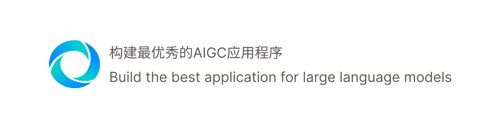

<p align="center">
  <a href="./README.md">简体中文</a> | 
  <a href="./README_EN.md">English</a>
</p>

## Product Remote URL

[Magic Emerge 官方地址](https://app.magicemerge.ai/)

## Product View


## Features 
1. 基于[dify](https://github.com/langgenius/dify) API进行开发
2. 开箱即用的专业版的聊天对话应用
3. 可视化的应用数据分析
4. 支持代码、表格的聊天内容展示
5. 支持dify应用配置以及接口调用次数限制


## QuickStart

1. 配置app springboot应用的启动信息 在`app/bluebird-app-start`的资源目录下找到`application.yml`

2. 配置`application-prod.yml` 文件内容, 替换下列内容

```yaml

spring:
  datasource:
    driver-class-name: org.postgresql.Driver
    url: jdbc:postgresql://localhost:5432/bluebird-app
    username: postgres
    password: bluebird123456
    

....

使用dify的cloud可以不替换


dify:
  openapi:
    url:
      https://api.dify.ai/
    version:
      v1/
    chat-path:
      chat-messages
    completion-path:
      completion-messages

....


腾讯短信平台

tencent:
  sms:
    secret-id: xxxxx
    secret-key: xxxxxxx
    endpoint: sms.tencentcloudapi.com
    timeout: 30000
    sdk-app-id: xxxx
    sign-name: xxxx
    template-id: xxxx


```


3. 使用docker部署

```shell

# 进入docker目录
cd docker

# 使用下列命令一键启动
docker-compose up -d

```

4. 初始化数据库

```sql

-- 初始化超级管理员
INSERT INTO public.sys_user (username, auth_password, wechat, avatar_url, phone_number, user_role, is_deleted, email,
                             is_active)
VALUES ('admin', 'xBDZ8qiR1aP24rkFBo4ncw==', '', '', 'xxxxx', 'SUPER_ADMIN', false, 'admin@magicemerge.ai', true);

-- manager_id 必须是超级用户的id
INSERT INTO public.workspace (id, name, is_valid, remark, create_by, create_at, update_by, update_at, is_deleted,
                              is_public, manager_id)
VALUES (1, 'Magic Emerge''s 默认空间', true, '默认空间', '', false, false, '1673979417059454978');

-- user_id 必须是超级用户的id
INSERT INTO public.workspace_members (id, workspace_id, username, user_id, user_type, create_by, update_by, is_deleted,
                                      is_active)
VALUES (1, 1, 'admin', '1673979417059454978', 'OWNER', '', '', false, true);


-- 增加应用类型

INSERT INTO public.app_category (id, category_name, is_valid)
VALUES (1, '客服', true);
INSERT INTO public.app_category (id, category_name, is_valid)
VALUES (2, '电商', true);
INSERT INTO public.app_category (id, category_name, is_valid)
VALUES (3, '角色扮演', true);
INSERT INTO public.app_category (id, category_name, is_valid)
VALUES (5, '法律', true);
INSERT INTO public.app_category (id, category_name, is_valid)
VALUES (6, '家装/工业设计', true);
INSERT INTO public.app_category (id, category_name, is_valid)
VALUES (4, '小工具', true);
INSERT INTO public.app_category (id, category_name, is_valid)
VALUES (8, 'UI设计', true);
INSERT INTO public.app_category (id, category_name, is_valid)
VALUES (7, '法律法规', true);
INSERT INTO public.app_category (id, category_name, is_valid)
VALUES (9, '政策解读', true);
INSERT INTO public.app_category (id, category_name, is_valid)
VALUES (10, '经济财报', true);
INSERT INTO public.app_category (id, category_name, is_valid)
VALUES (11, 'QA问答', true);
INSERT INTO public.app_category (id, category_name, is_valid)
VALUES (12, '代码助手', true);
INSERT INTO public.app_category (id, category_name, is_valid)
VALUES (13, '教育', true);

```


## Backend stack

- Java
- spring boot
- mybatis-plus

## Frontend stack

- next.js
- taliwind css
- echarts.js


## Roadmap

### ME1.0 - MVP

- 实现基于Prompt的对话型精选应用、支持应用权限管理
- 支持应用监控、活跃用户数，消息数、消耗token数以及费用
- 支持默认工作空间以及成员管理、成员角色管理
- 支持注册用户管理、包括用户激活，角色管理

### ME2.0 
- 支持响应式布局，兼容手机端
- 支持应用创建、自定义Prompt以及多种参数形式的输入
- 支持文本生成型对话
- 支持应用创建保存草稿箱、以及公开/私有权限
- 支持上传文档PDF、HTML、TXT、DOC作为上下文
- 支持对话开场白以及对话的语气方式以及语言
- 支持多种模型的选择
- 支持应用多标签
- 支持语音输入，text-to-audio
- 支持管理创建工作空间且可以对用户公开邀请/已注册用户邀请进入空间

### ME3.0

- 支持小插件/webapp方式嵌入第三方页面
- 支持自定义嵌入页面的样式
- 支持聊天内容的分享
- 支持多个问题的建议（看优先级可以放在2.0实现）
- 支持接入MJ，text-to-image, image-to-image
- 支持图像私密分享以及设置生成图像的公开/私有权限


### ME4.0

- 支持多种应用的编排能力-实现标准化的Agents


## Contributer


项目负责人/全栈开发: [@Zean Ma](https://github.com/GZ315200)

UI/UX设计: [@Emir](https://www.zcool.com.cn/u/22000389)


## Contact us

- 在我们的 [GitHub Repo](https://github.com/Magic-Emerge/magic-emerge) 上提交 Issue 或 PR
- 在我们的 [Discord 社区](https://discord.gg/SSpD6kbc) 上加入讨论
- 发送邮件至 offical@xuanyong.ai
- 作者: wechat


<a href="https://www.producthunt.com/posts/magic-emerge?utm_source=badge-featured&utm_medium=badge&utm_souce=badge-magic&#0045;emerge" target="_blank"></a>


## Star History

[](https://star-history.com/#Magic-Emerge/magic-emerge&Date)


